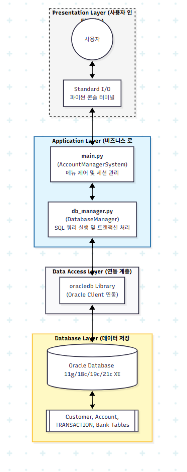

# 🏦 Bank System Project
> **안정적인 금융 트랜잭션 처리를 위한 Python 기반 뱅킹 시스템**

[](https://www.python.org/)
[](https://opensource.org/licenses/MIT)

---

## 📌 Project Overview
본 프로젝트는 사용자의 자산을 안전하게 관리하고, 금융 서비스의 핵심인 **데이터 무결성**과 **트랜잭션 안정성**을 확보하는 데 중점을 둔 뱅킹 시스템입니다. 

* **개발 기간**: 2026.04.13~04.20 (개인 프로젝트)
* **핵심 기능**: 자동 이체, 입출금 및 이체, 거래 내역 조회, 트랜잭션(rollback), 예외 처리(IntegrityError,DatabaseError) 

---

## 📺 Demo Video
> 이미지를 클릭하면 유튜브 영상으로 이동합니다.

| 전체 시연 영상 | 자동 이체 영상 |
| :---: | :---: |
| [](https://www.youtube.com/watch?v=7mrGftvUKHs) | [](https://www.youtube.com/watch?v=2L9ICxKN4JM) |

---

## 🏗 System Architecture
시스템의 흐름과 구성 요소를 시각화하여 설계 역량을 강조했습니다.



* **Logic Layer**: Python을 활용한 비즈니스 로직 및 예외 처리 구현
* **Data Layer**: 데이터베이스 정규화를 통한 데이터 중복 최소화 및 무결성 유지

---

## 📊 Database Design (ERD)
19개의 테이블로 구성된 체계적인 데이터베이스 모델링입니다.


* **주요 포인트**: 
    * `Customers`와 `Accounts`의 1:N 관계 설계를 통한 다중 계좌 지원
    * 모든 금융 활동을 `Transactions` 로그 테이블에 기록하여 추적성 강화
    * 계좌 잔액의 정합성을 보장하는 트랜잭션 처리

---

## 🛠 Tech Stack
* **Language**: Python
* **Database**: Oracle Database
* **Modeling**: ERD Mermaid.ai / Draw.io
* **Environment**: VS Code

---

## 🌟 Key Features & Problem Solving
단순한 코딩을 넘어 **문제 해결 과정**을 담았습니다.

### 1️⃣ 트랜잭션 안정성 확보 🔒
* **Problem**: 송금 과정 중 오류 발생 시, 한쪽 계좌에서만 돈이 빠져나가는 데이터 불일치 위험 확인.
* **Solution**: DB Transaction 기능을 도입하여 `Withdraw`(출금)와 `Deposit`(입금)을 하나의 원자적 단위로 묶어 처리. 실패 시 자동 Rollback 구현.

### 2️⃣ 객체지향 설계 (OOP) 활용 🧱
* **Solution**: 계좌(Account), 고객(User), 은행(Bank)을 객체 단위로 모듈화하여 코드의 재사용성과 유지보수성을 높임.

---

## 📁 Presentation & Documents
프로젝트의 기획부터 결과까지 정리된 상세 자료입니다.

* 📄 [프로젝트 발표 자료 (PPT)](docs/93zOiazkkzjlgnw.pdf)
* 📄 [프로젝트 핵심 기술 자료 (PDF)](docs/통합 계좌 관리 시스템 핵심 기술 정리 명세서.pdf)

---

## 📂 Project Structure
```text
├── src/                # 소스 코드
│   ├── main.py         # 메인 실행 파일
│   ├── db_manager.py   # DB 모델 및 객체 정의      
├── docs/               # 시스템 구성도, ERD,  PPT
└──
